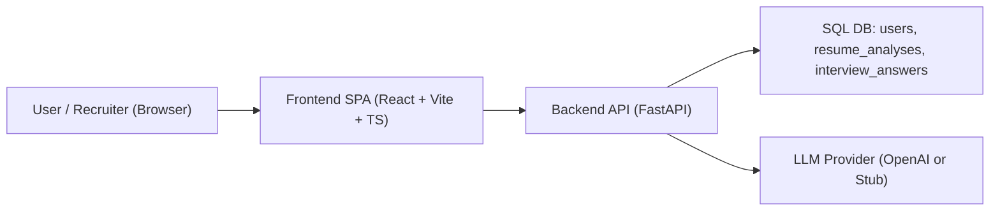
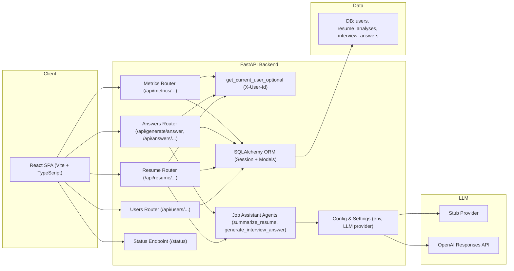
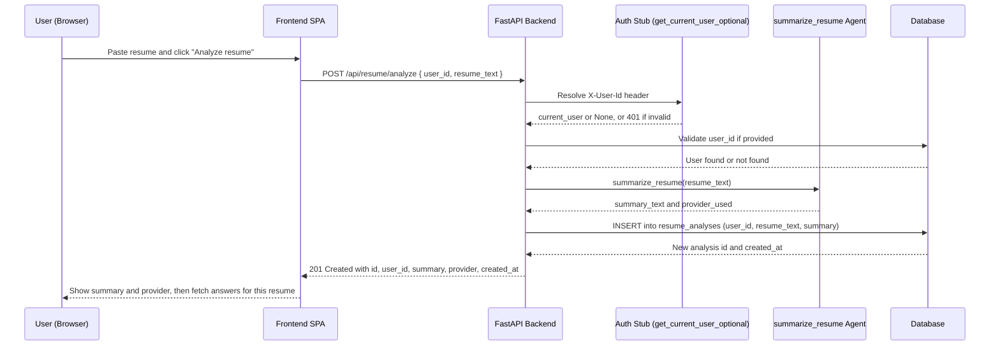

# AI Job Assistant – Architecture Overview

## 1. High-level overview

AI Job Assistant is a small full-stack application that helps a user:

- Store a basic user profile.
- Analyze a resume with an LLM-backed agent and store the summary.
- Generate interview answers based on stored resume analyses, job title, and company.
- View and delete stored resume analyses and answers.
- Inspect basic app and user metrics.

The stack is:

- **Frontend**: React + Vite + TypeScript + Tailwind CSS (single-page app)
- **Backend**: FastAPI + SQLAlchemy + Pydantic v2 + pytest
- **DB**: SQL database via SQLAlchemy (users, resume_analyses, interview_answers)
- **LLM provider**: OpenAI Responses API in production, stub provider in dev/tests

Authentication is stubbed using a custom `X-User-Id` header, resolved by
`get_current_user_optional`. This header is used to scope most list, metrics,
and delete operations to a “current user”.

---

## 2. System context

This diagram shows the main components and how they talk to each other.

---

## 3. Backend components

This diagram zooms into the FastAPI service and shows core routers, shared
dependencies, and external integrations.

Key points:

- **Routers**
  - `/api/users`: user creation and lookup.
  - `/api/resume`: resume analysis, listing, single fetch, answers-for-resume, delete.
  - `/api`: generate answer, list answers, get answer, delete answer.
  - `/api/metrics`: summary metrics and user-specific metrics.
  - `/status`: status and health information.
- **Shared dependencies**
  - `get_db` provides a SQLAlchemy session.
  - `get_current_user_optional` resolves the `X-User-Id` header into a `User | None`.

---

## 4. Request flow – Analyze Resume

This sequence diagram shows the end-to-end flow for
`POST /api/resume/analyze`.

A similar flow applies for `POST /api/generate/answer`, where the backend:

1. Resolves the current user via `X-User-Id`.
2. Validates the `user_id` and optional `resume_analysis_id`.
3. Calls `generate_interview_answer` with question + job context + resume summary.
4. Writes an `InterviewAnswer` row and returns the created answer.

---

## 5. Auth stub and scoping model

Authentication is intentionally simplified for this project and is handled via
an `X-User-Id` header:

- `get_current_user_optional`:
  - Returns `None` if the header is not present.
  - Returns a `User` instance when the header contains a valid user id.
  - Returns HTTP 401 when the header is present but does not match an existing user.

Endpoints use this helper to implement consistent behavior:

- **Resume and answer creation**:
  - If both header user and body `user_id` are set and mismatch → 400.
  - If header user is set and `user_id` is missing → default `user_id` to header user id.
  - If header user is missing → rely on explicit `user_id` in the body.

- **List endpoints (`GET /api/resume`, `GET /api/answers`)**:
  - If both header user and query `user_id` are set and mismatch → 400.
  - If header user is set and query `user_id` is missing → filter by header user.
  - If no header user, but query `user_id` is present → filter by that user.
  - Otherwise → return all records (paginated).

- **Delete endpoints**:
  - Require a valid header user.
  - Only allow deleting records owned by that user (or unowned records).
  - Return 403 for attempts to delete another user’s data.

---

## 6. LLM provider modes

The backend supports two LLM provider modes, configured via settings:

- **Stub provider**:
  - Used in development and tests.
  - Returns deterministic, echo-style content.
  - Allows pytest to assert on generic properties (e.g. provider name) without
    depending on real LLM output.

- **OpenAI provider**:
  - Uses the OpenAI Responses API with `OPENAI_API_KEY` from environment.
  - Used in real deployments.
  - Tests do not assert on exact answer text when this provider is enabled.

The current provider name is exposed via the `/status` endpoint and included in
API responses where applicable.

---

## 7. Metrics and observability

Metrics endpoints:

- `GET /api/metrics/summary`:
  - Returns:
    - `total_users`
    - `total_resume_analyses`
    - `total_answers`
    - `user_resume_analyses` (only when `X-User-Id` is present)
    - `user_answers` (only when `X-User-Id` is present)

- `GET /api/metrics/user`:
  - Requires a valid `X-User-Id` header.
  - Returns:
    - `user_id`
    - `resume_analyses`
    - `answers`

Logging:

- Logs warnings and errors for:
  - Duplicate user creation attempts.
  - Missing users, resumes, and answers.
  - Mismatched header/body user ids.
  - Database failures when creating or deleting records.
- Logs info-level messages on successful user creation, resume analysis creation,
  answer generation, and deletes.

This combination of metrics and logging supports debugging, basic observability,
and future extension into a more complete monitoring stack.
